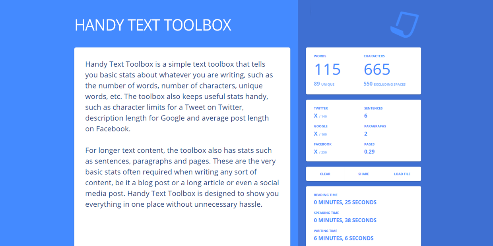

# Handy Text Toolbox

Handy Text Toolbox is a simple text toolbox that tells you basic stats about whatever you are writing, such as the number of words, number of characters, unique words, etc. The toolbox also keeps useful stats handy, such as character limits for a Tweet on Twitter, description length for Google and average post length on Facebook. For longer text content, the toolbox also has stats such as sentences, paragraphs and pages. These are the very basic stats often required when writing any sort of content, be it a blog post or a long article or even a social media post. Handy Text Toolbox is designed to show you everything in one place without unnecessary hassle.

We often compose longer text content on larger screen devices such as tablets and laptops. For people writing very long content, the toolbox also shows the average reading time (based on 275 words per minute reading pace), average speaking time (based on 180 words per minute speaking pace) and average writing time (based on 90 characters per minute writing pace). For people focusing on readability, the toolbox also generates the Flesch Reading score in real time giving you a fair estimate of the readability of the text.

Apart from the general features, the toolbox also has options to load content from a text file on your device. Whatever you type here is also saved in the browser to prevent accidental loss of data, whatever you type is by default safe from closing the tab accidentally or if the PC/browser crashes, all you have to do is to open this page again. We often want to share what we write and hence the editor also has an option to share content via a unique URL.